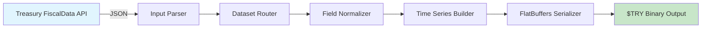
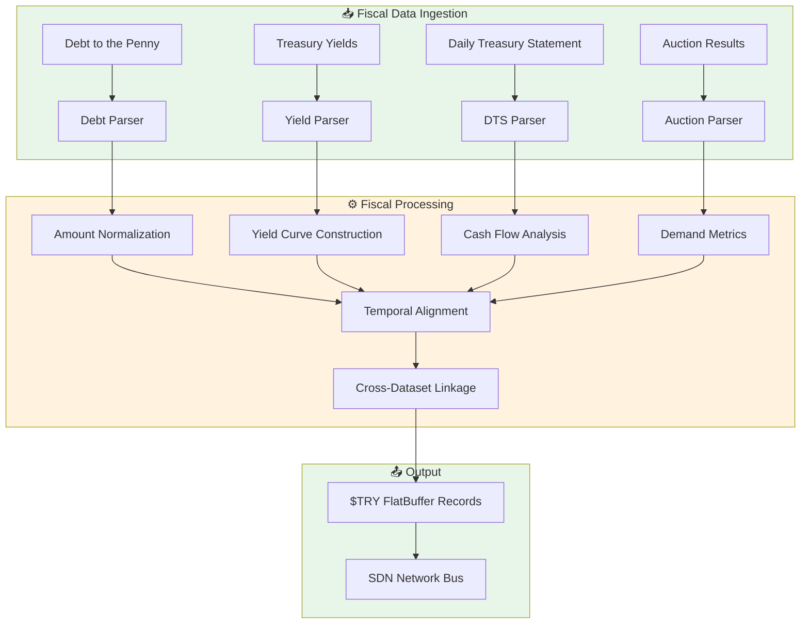

<](https://github.com/the-lobsternaut/treasury-sdn-plugin/actions)
[](LICENSE)
[](https://github.com/the-lobsternaut/space-data-network)
[](#output-format)

**US Treasury Fiscal Data** — national debt, treasury yields, and federal fiscal data from the Bureau of the Fiscal Service, compiled to WebAssembly for edge deployment.

---

## Overview

The US Treasury's FiscalData platform provides machine-readable access to federal government fiscal data including national debt to the penny, treasury securities auction results, daily treasury statements, and historical yield curves. This plugin ingests Treasury fiscal data and converts it to FlatBuffers-aligned binary format for integration into the Space Data Network.

### Why It Matters

- **Government spending capacity**: National debt trajectory signals fiscal constraints on NASA/DoD space budgets
- **Treasury yield curves**: Direct input for discounting future space program cash flows and contract valuations
- **Debt ceiling dynamics**: Track debt ceiling events that could disrupt government contract payments
- **Auction results**: Treasury auction demand signals appetite for US government debt affecting spending capacity
- **Historical depth**: Decades of fiscal data for long-term trend analysis

---

## Architecture



### Data Flow



---

## Data Sources & APIs

| Source | URL | Description |
|--------|-----|-------------|
| **Treasury FiscalData API** | https://api.fiscaldata.treasury.gov/ | All Treasury fiscal datasets |
| **API Documentation** | https://fiscaldata.treasury.gov/api-documentation/ | Full API reference |
| **Debt to the Penny** | https://fiscaldata.treasury.gov/datasets/debt-to-the-penny/ | Daily total public debt |
| **Treasury Yields** | https://home.treasury.gov/resource-center/data-chart-center/interest-rates | Daily yield curve rates |
| **Daily Treasury Statement** | https://fiscaldata.treasury.gov/datasets/daily-treasury-statement/ | Federal cash position |

---

## Research & References

- US Treasury (2024). ["FiscalData API Documentation"](https://fiscaldata.treasury.gov/api-documentation/). Bureau of the Fiscal Service.
- CBO (2024). ["The Budget and Economic Outlook"](https://www.cbo.gov/topics/budget). Congressional Budget Office.
- Gürkaynak, R. S., Sack, B., & Wright, J. H. (2007). ["The U.S. Treasury Yield Curve: 1961 to the Present"](https://doi.org/10.17016/FEDS.2006.28). Federal Reserve Board.
- Cochrane, J. H. (2011). ["Presidential Address: Discount Rates"](https://doi.org/10.1111/j.1540-6261.2011.01671.x). *Journal of Finance*, 66(4).

---

## Technical Details

### Key Datasets

| Dataset | Endpoint | Frequency | Description |
|---------|----------|-----------|-------------|
| **Debt to the Penny** | `/services/api/fiscal_service/v2/accounting/od/debt_to_penny` | Daily | Total public debt outstanding |
| **Average Interest Rates** | `/services/api/fiscal_service/v2/accounting/od/avg_interest_rates` | Monthly | Average rates on Treasury securities |
| **Treasury Offset Program** | `/services/api/fiscal_service/v2/debt/top/top_state` | Quarterly | Federal payment offsets |
| **Monthly Treasury Statement** | `/services/api/fiscal_service/v2/accounting/mts/mts_table_1` | Monthly | Federal receipts and outlays |

### Yield Curve Maturities

| Maturity | Description | Use Case |
|----------|-------------|----------|
| 1-Month | T-Bill | Short-term risk-free rate |
| 3-Month | T-Bill | Money market benchmark |
| 1-Year | T-Note | Short-term planning |
| 2-Year | T-Note | Monetary policy sensitivity |
| 5-Year | T-Note | Mid-term discount rate |
| 10-Year | T-Note | Long-term benchmark |
| 30-Year | T-Bond | Ultra-long infrastructure |

### Processing Pipeline

1. **JSON Ingestion** — Parse Treasury FiscalData API responses
2. **Dataset Routing** — Direct records to appropriate processors
3. **Field Normalization** — Standardize amounts, rates, and dates
4. **Time Series Construction** — Build ordered time series per metric
5. **Cross-Dataset Linkage** — Connect related fiscal indicators
6. **FlatBuffers Serialization** — Pack into `$TRY` aligned binary records

---

## Input/Output Format

### Input

JSON from Treasury FiscalData API:

```json
{
  "data": [
    {
      "record_date": "2024-01-15",
      "debt_held_public_amt": "26892206917601.89",
      "intragov_hold_amt": "6846764384141.71",
      "tot_pub_debt_out_amt": "33738971301743.60",
      "src_line_nbr": "1"
    }
  ]
}
```

### Output

`$TRY` FlatBuffer-aligned binary records:

| Field | Type | Description |
|-------|------|-------------|
| `timestamp` | `float64` | Unix epoch seconds of record date |
| `latitude` | `float64` | 0.0 (non-geographic data) |
| `longitude` | `float64` | 0.0 (non-geographic data) |
| `value` | `float64` | Amount or rate value |
| `source_id` | `string` | Dataset + field identifier |
| `category` | `string` | Fiscal data category |
| `description` | `string` | Human-readable description |

**File Identifier:** `$TRY`

---

## Build Instructions

### Quick Build

```bash
cd plugins/treasury
./build.sh
```

### Manual Build

```bash
cd plugins/treasury
git submodule update --init deps/emsdk
cd deps/emsdk && ./emsdk install latest && ./emsdk activate latest && cd ../..
source deps/emsdk/emsdk_env.sh
cd src/cpp && emcmake cmake -B build -S . && emmake make -C build
```

### Run Tests

```bash
cd src/cpp
cmake -B build -S . && cmake --build build && ctest --test-dir build
```

---

## Usage Examples

### Node.js

```javascript
import { SDNPlugin } from '@the-lobsternaut/sdn-plugin-sdk';

const plugin = await SDNPlugin.load('./wasm/node/treasury.wasm');

const debt = await fetch(
  'https://api.fiscaldata.treasury.gov/services/api/fiscal_service/v2/accounting/od/debt_to_penny?sort=-record_date&page[size]=30'
);
const result = plugin.parse(await debt.text());
console.log(`Parsed ${result.records} Treasury fiscal records`);
```

### C++ (Direct)

```cpp
#include "treasury/types.h"

auto dataset = treasury::parse_json(json_input);
for (const auto& record : dataset.records) {
    printf("💵 %s: $%.2f B — %s\n",
           record.source_id.c_str(), record.value / 1e9, record.category.c_str());
}
```

---

## Dependencies

| Dependency | Version | Purpose |
|-----------|---------|---------|
| **Emscripten (emsdk)** | latest | C++ → WASM compilation |
| **CMake** | ≥ 3.14 | Build system |
| **FlatBuffers** | ≥ 23.5 | Binary serialization |
| **C++17** | — | Language standard |

---

## Plugin Manifest

```json
{
  "schemaVersion": 1,
  "name": "treasury",
  "version": "0.1.0",
  "description": "US Treasury fiscal data (debt, yields). Parses treasury yields, national debt, fiscal data",
  "author": "DigitalArsenal",
  "license": "Apache-2.0",
  "inputFormats": ["application/json"],
  "outputFormats": ["$TRY"],
  "dataSources": [
    {
      "name": "treasury",
      "url": "https://api.fiscaldata.treasury.gov/",
      "type": "REST",
      "auth": "api_key (optional)"
    }
  ]
}
```

---

## Project Structure

```
plugins/treasury/
├── README.md
├── build.sh
├── plugin-manifest.json
├── deps/
│   └── emsdk/
├── src/cpp/
│   ├── CMakeLists.txt
│   ├── include/treasury/
│   │   └── types.h
│   ├── src/
│   │   └── treasury.cpp
│   ├── tests/
│   │   └── test_treasury.cpp
│   └── wasm_api.cpp
└── wasm/
    └── node/
```

---

## License

This project is licensed under the [Apache License 2.0](https://www.apache.org/licenses/LICENSE-2.0).

---

## Related Plugins

- [`fred`](../fred/) — Federal Reserve Economic Data
- [`bls`](../bls/) — Bureau of Labor Statistics
- [`usaspending`](../usaspending/) — Federal spending and defense contracts

---

*Part of the [Space Data Network](https://github.com/the-lobsternaut/space-data-network) plugin ecosystem.*
]]>